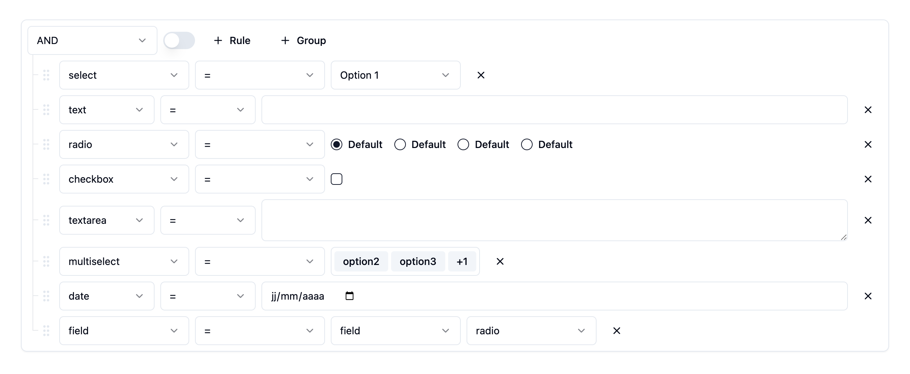

## @react-querybuilder/shadcn-ui



Unofficial [react-querybuilder](https://npmjs.com/package/react-querybuilder) components for [shadcn/ui](https://ui.shadcn.com).

## Installation

Copy and paste the [src/components/react-querybuilder-shadcn-ui](https://github.com/jide/react-querybuilder-shadcn-ui/tree/main/src/components/react-querybuilder-shadcn-ui) in your project.

## Usage

To render shadcn-ui-compatible components in the query builder, wrap the `<QueryBuilder />` element in `<QueryBuilderShadcnUi />`.

```tsx
import { QueryBuilderShadcnUi } from "@/components/react-querybuilder-shadcn-ui";
import { QueryBuilder, RuleGroupType } from "react-querybuilder";

const fields = [
  { name: "firstName", label: "First Name" },
  { name: "lastName", label: "Last Name" },
];

const App = () => {
  const [query, setQuery] = useState<RuleGroupType>({
    combinator: "and",
    rules: [],
  });

  return (
    <QueryBuilderShadcnUi>
      <QueryBuilder fields={fields} query={query} onQueryChange={setQuery} />
    </QueryBuilderShadcnUi>
  );
};
```

## Notes

- Some additional styling may be necessary, see [src/components/react-querybuilder-shadcn-ui/styles.scss](https://github.com/jide/react-querybuilder-shadcn-ui/tree/main/src/components/react-querybuilder-shadcn-ui/styles.scss)
